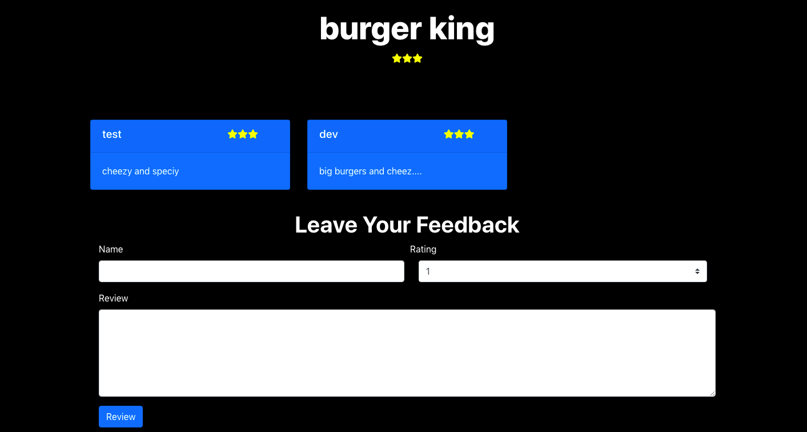

# Yelp Clone 
Building a yelp clone using PERN stack.

# Motivation 
After learning all stack tool I wanted to build somthing real world Application. This is also my first application using Postgres SQL.

# Build status

# Code Style
- Server side code **standard**
- Client side code **PascalCase** 

# Screenshots

# Tech/framework used

- [Node](https://nodejs.org/en/)
- [Express](https://expressjs.com/)
- [PostgreSQL](https://www.postgresql.org/)
- [React](https://reactjs.org/)
- [React Router DOM](https://reactrouter.com/web/guides/quick-start)

